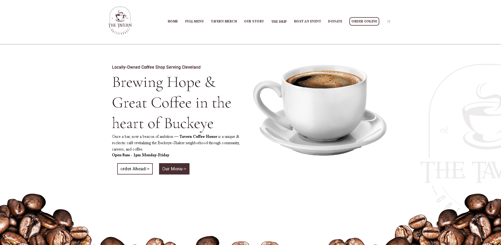
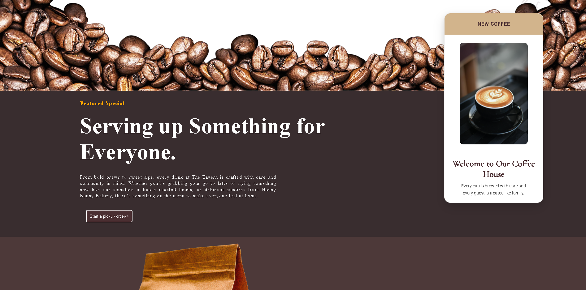
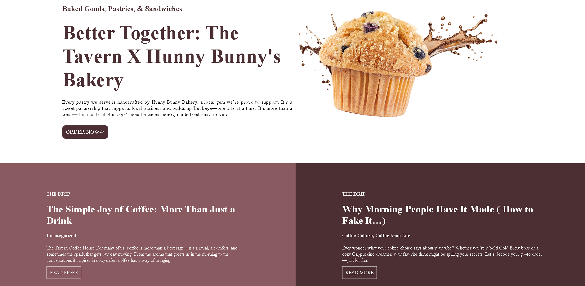

# Tavern Coffee House Landing Page

A modern coffee shop landing page built using HTML and CSS. This project was created to strengthen my frontend development skills by implementing a real-world website layout with multiple sections, custom styling, and scroll-based animations.

## Technologies Used

* HTML5
* CSS3
* Flexbox
* Google Fonts
* AOS (Animate On Scroll)

## Features

* Sticky navigation bar
* Hero section with call-to-action buttons
* Featured coffee showcase
* Product promotion section
* Bakery collaboration section
* Blog section
* Footer with business information
* Scroll animations

## Project Structure

```text
Tavern-Coffee-House/
│
├── index.html
├── website.css
├── coffee.jpg
├── screenshots/
│   ├── image1.png
│   ├── image2.png
│   └── image3.png
│
└── README.md
```

## Project Screenshots

### Homepage / Hero Section

The landing page features a clean navigation bar, branding elements, and a hero section designed to introduce the coffee shop and encourage user interaction.



### Featured Content & Product Showcase

This section highlights featured products, promotional content, and information about the coffee shop's offerings.



### Additional Sections & Footer

This section includes partnership content, blog previews, and footer information that completes the overall user experience.



## What I Learned

Through this project, I practiced:

* Structuring webpages using semantic HTML
* Creating layouts with Flexbox
* Working with typography and images
* Implementing CSS animations and hover effects
* Organizing project files efficiently
* Building a complete landing page from scratch

## Future Improvements

* Improve mobile responsiveness
* Add interactive dropdown navigation
* Integrate a Python backend
* Connect forms to a database
* Add dynamic content and user interactions

## Author

Adithya

Aspiring Python Full Stack Developer

This project is part of my learning journey toward becoming a Python Full Stack Developer and building a portfolio of real-world web applications.
